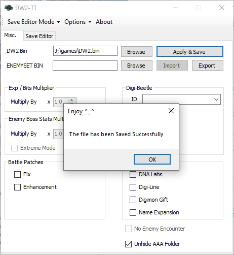
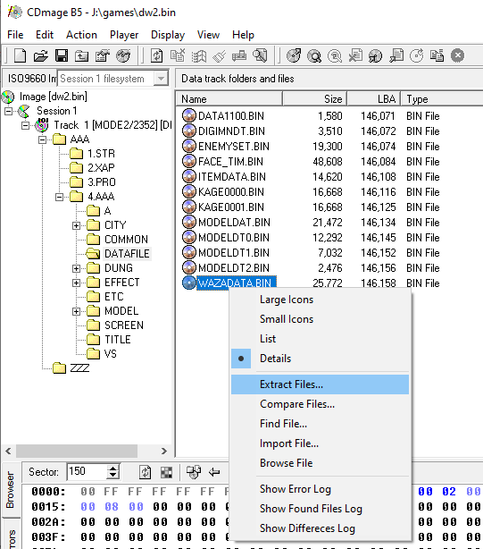
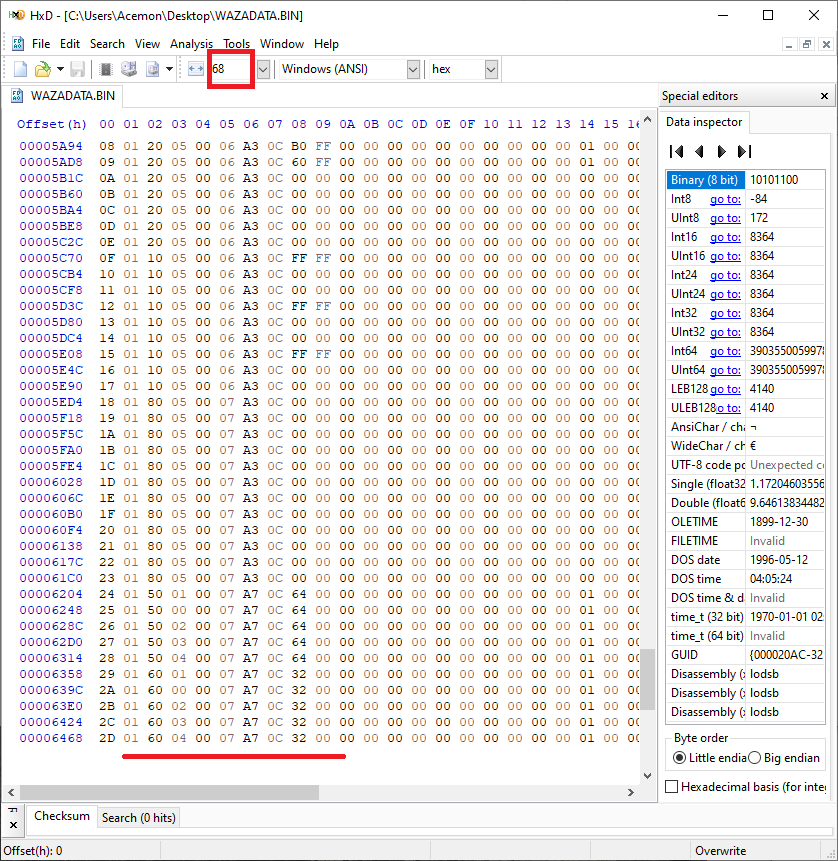
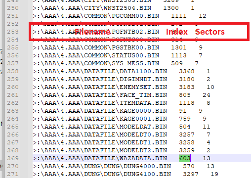
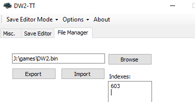
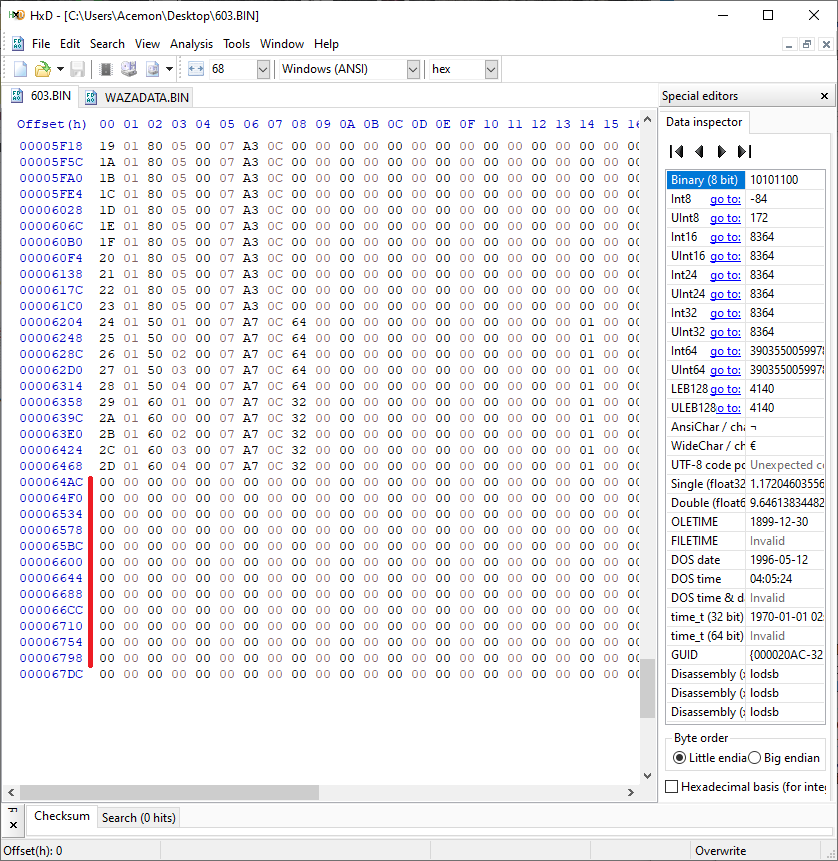
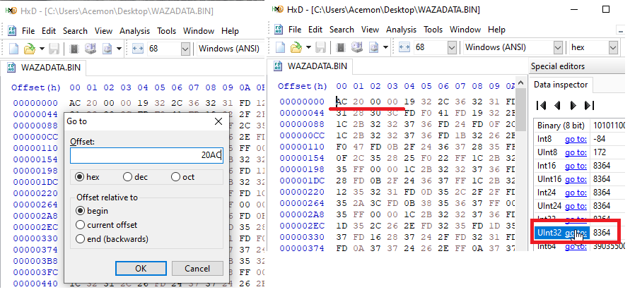
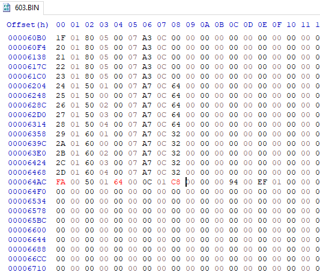
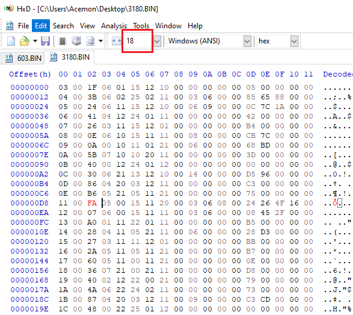

# File-Manager Tutorial
This tutorial is for people who knows DW2 file structure. It will help insert, extract and apply changes to the game easily.

Let's say we want to add a powerful Tech and assign it to Gabumon.
The basic idea is to export the files, edit them and then import them back into the game. Let’s start!

### Exporting
First let's extract Tech Data, it resides in WAZADATA file. Start by opening the DW2 Bin file on CDmage.
All PSX games have the M2/2352 image type

(File-Manager/e1.PNG)

All the game files are in the AAA folder which is initially hidden.

To unhide them just open DW2-TT, select DW2 Bin, check unhide AAA folder and Apply & Save

Now we can see the files so let’s open the bin again on CDmage, extract WAZADATA file located in `\AAA\4.AAA\DATAFILE\WAZADATA.BIN` and save it somewhere

Now let’s open that WAZADATA file on HxD hex editor and set the "Bytes per Row" to 68 because
each Tech is 68 bytes long.
Well, we want to add a new Tech but from what we can see, we have no space at the end of the file.

Actually, for some reason, PSX files must be aligned by sectors (a sector’s size is 2352 byte raw, with 2048 actual data).
Any file data that cannot fit in a complete sector is trailed by zeroes. In our case, WAZADATA file has 13 sectors so it is 26.0K (13 * 2048) in size and what we extracted was 25.1K, so the remaining are zeroes.
Let's extract it using DW2-TT. Click option, go to Options > File-Manager, select DW2 bin then add a file index (each one in a single line) in the list box.
To find any file index, open [FileList.txt](https://github.com/acemon33/dw2-tt/dw2_exp_multiplier/Resources/FileList.txt) in Resources Folder, search by the name and get the index.

Finally click export button and choose destination folder.

As you can see, we have empty data!! We can fill up to 12 new Techs!!!

You can edit the file using any method you like, but here I will show you how to edit by Hex-Editor or by DW2-Editor.

### Editing Method A
Here we want to add a Tech. You can add a completely new one (if you know what you are doing), but we will copy an existing one and modify it.
The first 4 bytes is a pointer to the Tech list, you can go there either by Go To (Ctrl+G)

or put the cursor at the beginning of the value and press go-to beside UInt32 under Data Inspection Window.

At offset 0x20AC is the first Tech (Techs are 68 bytes long and the 1st column are the IDs). Let’s take Blue Blaster, which starts at 0x2288.

Copy the whole row then paste it (overwrite the zeroes by Ctrl+B ) at the end (after the last record).
Let's make the attack power 100, MP consumes 100 and give it an ID, so edit AP column to 0x64 and MP column to 0xC8 (the game divides by 2) and give it a unique ID (unused one), I chose 0xFA.

Or you can just take (copy and overwrite) my version below:

`
FA 00 50 01 64 00 0C 01 C8 00 00 00 94 00 EF 01 08 00 08 00 01 00 00 00 00 00 00 00 00 00 00 00 01 00 00 00 10 01 00 00 1C 01 00 00 00 00 3C 0C 49 04 00 00 5B 0C 4A 04 00 00 BA 03 8C 0B 00 00 94 03 B5 0B
`

After applying the change, save the modified file.

Now we have to assign that customized Tech to Gabumon.
1. Extract DIGIMNDT.BIN (index is 3180)
2. Open it by Hxd, set the Width to 18
3. Assign Gabumon (ID: 0x11) the customized Tech (ID: 0xFA)
4. Save the file

### Editing Method B
You can edit Enemy Encounter, Digimon Evolution and Tech Data by using DW2-Editor, here is a [video tutorial](https://www.youtube.com/watch?v=cycMi9Al6tY)

Once you finish editing don't rebuild the game, just import them as described in the next section.

### Importing
On File-Manager tab, add a file index / files indexes (each one in a single line) in list box. In our case we have two files with indexes 603 and 3180. 
Finally click import button and choose the folder that contained the edited files.

### Conclusion
This feature is great to edit few files of the game quickly, but if you want to edit many files and change their sizes (if you know what you are doing), you have to rebuild the whole game by using the [DigimonWorld2ISOBuilder](https://github.com/chaoswargreymon/DigimonWorld2ISOBuilder).

This tutorial available in [pdf format](file-manager Tutorial.pdf).