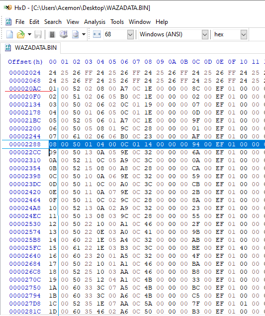

# File-Manager Tutorial
This tutorial for people who knows better in DW2 files structures, it will help to insert, extract and do some changes to the game easily.

Let's say we want to add a powerful Tech and assign it to Digimon Gabumon.
The idea behind is exporting the related files, editing and importing to the game, let us get start!

### Exporting
First let's extract Tech Data, it resides in WAZADATA file, so let's open by Cdmage.
All PSX games are Mode 2 / 2352

Well all the game files are in AAA folder which is hidden,

to unhide them open DW2-TT and select DW2 Bin, check unhide AAA folder and Apply & Save

now we can see the files in other programs, let us open again by Cdmage and extract WAZADATA file located in \AAA\4.AAA\DATAFILE\WAZADATA.BIN and saved it somewhere

Now let’s open it by HxD hex editor, set the “Bytes per Row” to 68 because each Tech is 68 bytes long.
Well we want to add a new Tech but what we can see, we have no space at the end of the file

Actually for some reason, PSX files must be aligned by sectors (a sector size: 2352 byte raw, 2048 actual data).
Any file data that cannot fit a complete sector, it trailed by zeroes, in our case, WAZADATA file has 13 sectors so it is 26.0K (13 * 2048) on disk image and what we extracted was 25.1K, so the remaining are zeroes.
let's extract it by using DW2-TT, click option and check File-Manager then the File-Manager tab will appear, select DW2 bin then add a file index (each one in a single line) in the list box.
To find any file index, open [FileList.txt](https://github.com/acemon33/dw2-tt/dw2_exp_multiplier/Resources/FileList.txt) in Resources Folder, search by the name and get the index.

Finally click export button and choose destination folder.

As you can see! we have empty data!!, we can fill upto 12 new Techs!!!

You can edit the file whatever method you like, but here I will show you how to edit by Hex-Editor or by DW2-Editor.

### Editing Method A
Here we want to add a Tech, you can completely add a new One (if you know what you are doing), but we will copy an existing one and modify it,
The first 4 bytes is a pointer to the Tech list, you can go there **either** by Goto (`Ctrl + G`)

or put the cursor at the beginning of the value and press go-to beside UInt32 under Data Inspection Window

0x20AC is the first Tech, a Tech is 68 bytes long, the 1st column are the ID(s), we will take Blue Blaster Tech which starts at 0x2288

So copy the whole row then paste it (overwrite the zeroes by Ctrl+B ) at the end (after the last Record).
let's make the attack power 100, MP consumes 100 and give it an ID, so edit AP column to 0x64 and MP column to 0xC8 (the game divides by 2)  and give it a unique ID (unused one), I chose 0xFA.

or you can take (copy and overwrite) my version below:

`
FA 00 50 01 64 00 0C 01 C8 00 00 00 94 00 EF 01 08 00 08 00 01 00 00 00 00 00 00 00 00 00 00 00 01 00 00 00 10 01 00 00 1C 01 00 00 00 00 3C 0C 49 04 00 00 5B 0C 4A 04 00 00 BA 03 8C 0B 00 00 94 03 B5 0B
`

Save the file.

Now we have to assign the customized Tech to Gabumon.
1. Extract DIGIMNDT.BIN (index is 3180)
2. Open it by Hxd, set the Width to 18
3. Assign Gabumon (ID: 0x11) the customized Tech (ID: 0xFA)

Save the file.

### Editing Method B
you can edit Enemy Encounter, Digimon Evolution and Tech Data by using DW2-Editor, here is a video tutorial~~~
Once you finish editing don't rebuild the game, just import them as described in the next section.

### Importing
On File-Manager tab, add a file index / files indexes (each one in a single line) in list box, in our case we have two files with indexes 603 and 3180, 
finally click import button and choose the folder that contained the edited files

### Conclusion
This is not a modding tutorial, it is just a way to demonstrate the File-Manager features and how to take advantage of empty data at the end of files.
This feature is great to edit few files of the game quickly, but if you want to edit many files and change their sizes (if you know what you are doing), 
you have to rebuild the whole game by [DigimonWorld2ISOBuilder](https://github.com/chaoswargreymon/DigimonWorld2ISOBuilder).